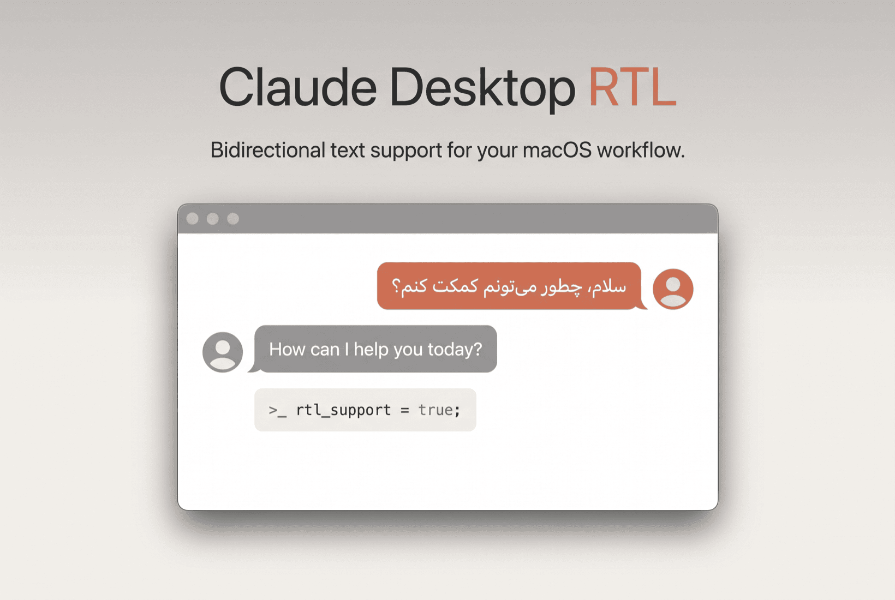

<div align="center">
  
</div>

<p align="center">
  <a href="README.md">English</a> ·
  <b>فارسی</b>
</p>

<p align="center">
  
  <a href="LICENSE"></a>
  
  
  <a href="https://github.com/soheil42/claude-desktop-rtl/stargazers"></a>
</p>

<div dir="rtl">

# پشتیبانی راست‌به‌چپ (RTL) برای Claude Desktop روی مک

این ابزار پشتیبانی درست‌وحسابی از متن راست‌به‌چپ (فارسی، عربی، عبری، اردو و…) رو به
[Claude Desktop](https://claude.ai/download) روی مک اضافه می‌کنه. متن راست‌به‌چپ رو همون
لحظه تشخیص می‌ده — هم موقعی که تو کادر داری تایپ می‌کنی، هم وقتی جواب‌های Claude دونه‌دونه
میان — و می‌چینه‌شون سمت راست، در حالی که بلوک‌های کد و فرمول‌های ریاضی چپ‌به‌راست می‌مونن.

نگران Claude خودت نباش؛ دست بهش نمی‌زنه. یه نسخهٔ جدا و وصله‌خورده می‌سازه تو
`/Applications/Claude-RTL.app` و نسخهٔ اصلی رو همون‌جوری که هست ول می‌کنه.

---

## چی داره

- **تشخیص زندهٔ راست‌به‌چپ** — هم تو کادر تایپ، هم تو جواب‌های استریم‌شده؛ نه دکمه‌ای می‌خواد، نه تنظیمی.
- **فونت فارسی/عربی از پیش آماده** — فونت [Vazirmatn](https://github.com/rastikerdar/vazirmatn)
  رو همراهش داره و به‌صورت پیش‌فرض روی متن راست‌به‌چپ می‌ذاره (خودش هم نصبش می‌کنه). نخواستی؟ با `--no-font` خاموشش کن.
- **کد و ریاضی چپ‌به‌راست می‌مونن** — `pre`/`code` و KaTeX و MathJax و MathML هیچ‌وقت آینه نمی‌شن.
- **دسترسی‌هایی که می‌مونن** — نسخهٔ وصله‌خورده با یه هویت پایدار امضا می‌شه، برای همین مک دسترسی
  «ضبط صفحه» (Screen Recording) و بقیهٔ مجوزها رو یادش می‌مونه و هر بار ازت نمی‌پرسه.
- **بدون خراب‌کاری** — `Claude.app` اصلی اصلاً دست نمی‌خوره و به‌روزرسانی خودکارشم سر جاش می‌مونه.
- **آیکون و هویت خودش** — یه آیکون با نشان «RTL» و bundle id جدا، که راحت کنار نسخهٔ اصلی بشینه.

---

## چی لازم داری

- مک (روی macOS 15 Sequoia و macOS 26 Tahoe تست شده)
- Claude Desktop نصب‌شده تو `/Applications/Claude.app`
- [Node.js](https://nodejs.org/) نسخهٔ ۱۶ به بالا (برای `npx` و بسته‌های `@electron/asar` و `@electron/fuses`)
- ابزار خط فرمان Xcode (برای `codesign`) — با `xcode-select --install` نصبش کن

---

## شروع سریع

```bash
git clone https://github.com/soheil42/claude-desktop-rtl.git
cd claude-desktop-rtl
./patch.sh --install
```

این کار `/Applications/Claude-RTL.app` رو می‌سازه، فونت Vazirmatn رو نصب می‌کنه و اجراش می‌کنه.
فایل ZIP رو دانلود کردی؟ اول `chmod +x patch.sh` رو بزن.

---

## استفاده

```bash
./patch.sh --install                       # نسخهٔ وصله‌خورده رو بساز (Vazirmatn پیش‌فرضه) و اجرا کن
./patch.sh --install --no-font             # فقط جهت راست‌به‌چپ، فونت دست‌نخورده
./patch.sh --install --font "B Nazanin"    # یه فونت دیگه استفاده کن
./patch.sh --uninstall                     # نسخهٔ وصله‌خورده رو پاک کن (اصلی دست‌نخورده)
./patch.sh --status                        # نسخه‌ها و وضعیت fuse رو نشون بده
./patch.sh                                 # منوی تعاملی
```

`--install` بی‌خطره و هر چند بار بخوای می‌تونی اجراش کنی — مثلاً بعد از هر به‌روزرسانی Claude.

### اولین اجرا (فقط یه بار)

- **پیام Keychain** — به دسترسی «Claude Safe Storage» اجازه بده. امضای نسخهٔ وصله‌خورده با اصلی
  فرق داره، برای همین مک یه بار می‌پرسه.
- **ضبط صفحه (Screen Recording)** — اگه از قابلیتی استفاده می‌کنی که بهش نیاز داره، یه بار از مسیر
  System Settings → Privacy & Security → Screen & System Audio Recording روشنش کن. چون امضا پایداره،
  بعدش دیگه می‌مونه و هر بار نمی‌پرسه.

---

## فونت

به‌صورت پیش‌فرض **Vazirmatn** رو روی متن راست‌به‌چپ می‌ذاره و تو `~/Library/Fonts` نصبش می‌کنه.
چرا نصب لازمه؟ چون رابط گفتگو از `claude.ai` لود می‌شه و سیاست امنیتیش (CSP) نمی‌ذاره فونت
جاسازی‌شده لود شه؛ پس اون نسخه‌ای که با `local()` صداش می‌زنیم و رو سیستم نصبه، همونیه که واقعاً
تو گفتگو دیده می‌شه.

- **فونت دلخواه خودت:** فایل‌های `.ttf`/`.otf`ت رو بریز تو `fonts/` و `./patch.sh --install --font "<اسم فونت>"`
  رو بزن. خودش جاسازی و نصبشون می‌کنه.
- **فونتی که از قبل رو سیستم داری:** `./patch.sh --install --font "B Nazanin"`.
- **اصلاً فونت عوض نشه:** `./patch.sh --install --no-font`.

> **عبری:** ویزیرمتن فارسی و عربی و لاتین رو داره ولی گلیف عبری نداره — برای همین متن عبری برمی‌گرده
> رو فونت عبری سیستم. عبری‌کار هستی؟ یه فونت عبری (مثل Heebo یا Rubik یا Assistant) بذار تو `fonts/`
> و اسمشو با `--font` بده.

---

## بعد از به‌روزرسانی Claude

به‌روزرسان خودکار Claude فقط به نسخهٔ اصلی `/Applications/Claude.app` کار داره. نسخهٔ وصله‌خورده
جداست، برای همین بعد از هر آپدیت کافیه دوباره بسازیش:

```bash
./patch.sh --install
```

گواهی امضا و فونت نصب‌شده دوباره استفاده می‌شن، پس دیگه لازم نیست مجوزها رو از نو بدی.

---

## چطوری کار می‌کنه

۱. `Claude.app` رو کپی می‌کنه تو `Claude-RTL.app` (به اصلی کاری نداره).
۲. به کپی، آیکون و اسم و bundle id خودشو می‌ده.
۳. `app.asar` رو باز می‌کنه، پیلود RTL (و CSS فونت) رو می‌چسبونه اولِ باندل‌های رندرر و دوباره می‌بندتش.
۴. fuse مربوط به `EnableEmbeddedAsarIntegrityValidation` رو تو Electron خاموش می‌کنه (بعد از دست‌کاری
   آرشیو مجبوری، وگرنه Electron لودش نمی‌کنه).
۵. با یه هویت خود-امضا (self-signed) و پایدار که یه بار تو Keychain لاگین ساخته می‌شه، دوباره امضاش می‌کنه.
۶. فونت همراه رو تو `~/Library/Fonts` نصب می‌کنه.

تشخیص راست‌به‌چپ هم از روش استاندارد «اولین حرف جهت‌دار» تو یونیکد و یه `MutationObserver` استفاده
می‌کنه که پابه‌پای محتوای استریم‌شده جلو بره.

---

## اگه به مشکل خوردی

- **موقع باز شدن می‌گه «Claude quit unexpectedly»** — دوباره `./patch.sh --install` رو بزن؛ fuse مربوط
  به ASAR رو از نو خاموش می‌کنه. مطمئن شو `npx --yes @electron/fuses --help` کار می‌کنه.
- **متن راست‌به‌چپ تراز نمی‌شه** — حواست باشه `Claude-RTL` رو باز کرده باشی، نه اصلی رو. یه کم فارسی
  یا عربی یا عبری تایپ کن تا تشخیص فعال شه.
- **فونت تو گفتگو ویزیرمتن نیست** — این فونت باید رو کل سیستم نصب باشه (نصب‌کننده خودش این کارو می‌کنه).
  ببین `~/Library/Fonts/Vazirmatn-*.ttf` هست یا نه، بعد برنامه رو دوباره باز کن.
- **موقع نصب دوباره می‌پرسه «…wants to modify applications»** — عادیه؛ پوشهٔ `/Applications` با
  App Management محافظت می‌شه. اجازه بده.
- **هشدار Gatekeeper** — چون کپی خود-امضاست، بار اول شاید لازم شه راست‌کلیک → Open کنی یا از مسیر
  System Settings → Privacy & Security → Open Anyway بری جلو.
- **خطای «`.vite/build/ not found`»** — یه آپدیت Claude ساختار برنامه رو عوض کرده و وصله باید برای
  چیدمان جدید آپدیت شه.

---

## حذف

```bash
./patch.sh --uninstall
```

`/Applications/Claude-RTL.app` رو پاک می‌کنه. به Claude اصلی کاری نداره. گواهی `Claude RTL Local` تو
Keychain و فونت نصب‌شده سر جاشون می‌مونن تا نصب بعدی مجوزاش حفظ شه — اگه می‌خوای همه‌چی تمیز شه، دستی پاکشون کن.

---

## مجوز

MIT — به [LICENSE](LICENSE) نگاه کن. فونت همراه Vazirmatn تحت مجوز SIL Open Font License 1.1‌ه — به
[fonts/OFL.txt](fonts/OFL.txt) سر بزن.

</div>
